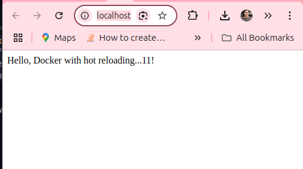

# Node.js Development Environment with Docker and Hot Code Reloading
<mark>Hot Module Reload (HMR)</mark> is a feature primarily <u>useful in development environments</u>. It allows you to see changes instantly in your application <mark>without needing a full refresh or restart</mark>. <u>This feature significantly enhances the development workflow by maintaining the application’s state while updating the changes</u>.

## Installation
To get started, you'll need to set up a new Node.js project and install the necessary dependencies.

```sh
  mkdir project
  cd project
  npm init -y 
  npm i express 
  npm i --save-dev nodemon 
```


## Project Structure
```sh
  project/
    ├── app/
    │   └── server.js
    ├── docker-compose.yml
    ├── .env
    └── package.json
```
<div style="page-break-after: always;"></div>

## Working code 

### `app/server.js` File
Here’s an example of the server.js file where we configure an Express server to serve a basic message:

```js
// app/server.js
const express = require('express');
const app = express();
const PORT = process.env.PORT || 1234;

app.get('/', (req, res) => {
  res.send('Hello, Docker with hot reloading...1!');
});

app.listen(PORT, () => {
  console.log(`Server running at http://localhost:${PORT}`);
});
```
<div style="page-break-after: always;"></div>

### package.json File
Your `package.json` should include a script to start the development server using nodemon, which automatically restarts the server when file changes are detected.

```json
{
  "name": "docker-hot-reload-example",
  "version": "1.0.0",
  "main": "app/server.js",
  "scripts": {
    "dev": "nodemon app/server.js"
  },
  "dependencies": {
    "express": "^4.17.1"
  },
  "devDependencies": {
    "nodemon": "^2.0.22"
  }
}
```

<div style="page-break-after: always;"></div>

### `docker-compose.yml` File
Docker Compose is used to simplify the setup. The `docker-compose.yml` configuration defines the app service with necessary volumes and environment variables for hot reloading.

```yaml
version: '3'
  services:
    app:
      image: node:18
      working_dir: /usr/src/app
      volumes:
        - .:/usr/src/app  # Mounts the project for hot reloading
        - nodemodules:/usr/src/app/node_modules  # Uses named volume for node_modules
      environment:
        - NODE_ENV=development
      command: bash -c "npm install && npm run dev"
      ports:
        - "1234:1234"  # Maps container port to localhost

  volumes:
    nodemodules:
      driver: local  # Defines the named volume for node_modules
```
<div style="page-break-after: always;"></div>


### `.env` Configuration
Create a .env file to store environment variables such as the port number and the environment mode.

```sh
  PORT=1234
  NODE_ENV=development
```

<div style="page-break-after: always;"></div>


## Build Project
To build and start your project, use the following Docker Compose commands:

```sh
  docker compose build
  docker compose up -d
```


<div style="page-break-after: always;"></div>

## Output 
### `http://localhost:1234/`




<div style="page-break-after: always;"></div>


This will build the project and run it in the background with hot code reloading enabled. Any changes made to the application files will be reflected immediately without the need to restart the server manually.

By using Docker and hot reloading in your `Node.js` development environment, you can streamline your development process and improve productivity.

<div style="page-break-after: always;"></div>


