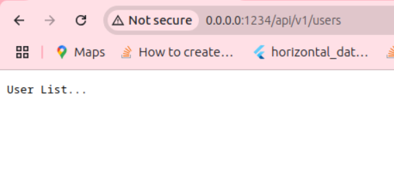
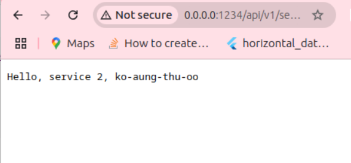
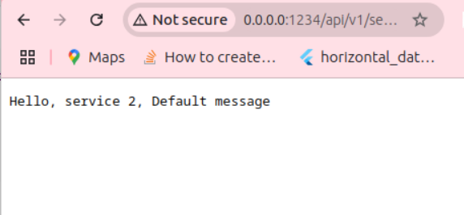

# Node.js- Building a Modular Express.js Application with Router Factories
<mark>Creating modular, maintainable applications is a central tenet of good software design.</mark> In Node.js with Express, we can achieve this by implementing router factories. This approach not only <mark>keeps our code organized</mark> but also <mark>enables us to add reusable</mark>, configurable routes for various features in the app.

## Setting Up a Modular Structure
### Simple example
#### project structure 
```sh
  app/
  ├── server.js
  └── users.js 
```
<div style="page-break-after: always;"></div>

#### Code Walkthrough
1. server.js

```js 
  // app/server.js
  const express = require('express');
  const app = express();
  const PORT = process.env.PORT || 1234;
  const userMiddleware = require('./users');

  app
    .use('/api/v1/', userMiddleware( {message: "User List..."}) ); 

  app.listen(PORT, () => {
    console.log(`Server running at http://localhost:${PORT}`);
  });
```
<div style="page-break-after: always;"></div>

2. users.js
```js 
  const express = require('express');
  const users =  function(options = {}){
    const router = express.Router();

    router.get('/users', (req, res, next) => {
      res.end(options.message); 
    })

    return router; 
  }
  module.exports = users; 
```
<div style="page-break-after: always;"></div>

## Testing in browser: 
```sh
http://0.0.0.0:1234/api/v1/users 
```


<div style="page-break-after: always;"></div>

## A More Complex Example with a Service Class
#### project structure 
```sh
  app/
  ├── server.js
  └── users.js 
```
1. server.js

```js
  // app/server.js
  const express = require('express');
  const app = express();
  const PORT = process.env.PORT || 1234;

  const userMiddleware = require('./users');


  class UserService{
    constructor(message = "Hello"){
      this.message = message; 
    }

    createMessage(name){
      return `${this.message}, ${name}` 
    }
  }

  app
    .use('/api/v1/service1', userMiddleware({
      service: new UserService('Hello, service 1')
    }))
    .use('/api/v1/service2', userMiddleware({
      service: new UserService('Hello, service 2')
    }));


  app.listen(PORT, () => {
    console.log(`Server running at http://localhost:${PORT}`);
  }); 
```
<div style="page-break-after: always;"></div>

2. users.js
```js
const express = require('express');

const users =  function(options = {}){
  const router = express.Router();

  // Get controller 
  const {service} = options; 

  router.get('/users', (req, res, next) => {
    res.end(
      service.createMessage(req.query.name || 'Default message')
    ); 
  })

  return router; 
}

module.exports = users;  
```
<div style="page-break-after: always;"></div>

## Testing in browser: 
```sh
http://0.0.0.0:1234/api/v1/service1/users?name=ko-aung-thu-oo 
```


```sh
http://0.0.0.0:1234/api/v1/service2/users
```


<div style="page-break-after: always;"></div>


